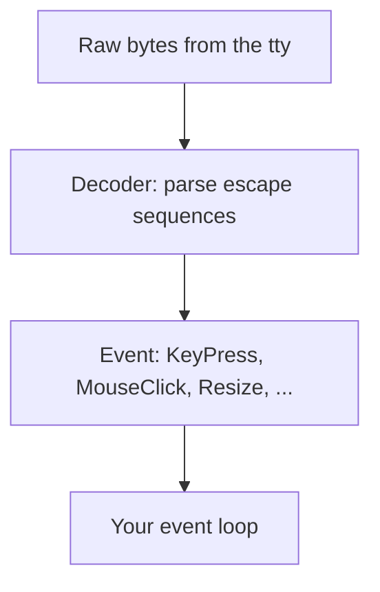

In [raw mode]() the terminal hands you a bare byte
stream. A keypress might be one byte (`a`), the click of a mouse might be a
dozen, and an arrow key arrives as a little escape sequence. uncurses turns that
stream into typed *events* so you match on `KeyPress` instead of decoding bytes
by hand. Because uncurses raw mode disables ISIG, keys like Ctrl-C and Ctrl-Z
arrive as key events instead of signals.

## From bytes to events

The path from a keystroke to something you can match on has three stops.



Escape sequences can straddle reads, so the decoder buffers partial input and
returns whole events. You never see the half-parsed middle.

## What an event can be

Events cover everything the terminal reports, not just keys:

- **Input**: `KeyPress`, `KeyRepeat`, `KeyRelease`, and the mouse family
  (`MouseClick`, `MouseRelease`, `MouseWheel`, `MouseMove`).
- **Lifecycle**: `Resize` when the window changes, `FocusIn` and `FocusOut`,
  `Visibility` when the view becomes observable or hidden, and
  bracketed-paste events: `PasteStart`, `PasteChunk`, and `PasteEnd`.
- **Replies**: answers to questions you or `Screen` asked the terminal, like
  `CursorPosition`, `BackgroundColor`, or `ColorScheme`. Capability probing is
  on by default through `ScreenOptions::query_capabilities`, so these arrive on
  the same stream as user input.
- **Unknown**: anything the decoder recognizes the shape of but not the meaning,
  handed back as raw bytes rather than dropped.

## The event source

An `EventSource` wraps an input handle and owns the decoder. Its blocking API
gives you three ways to read, depending on how much control you want:

- `read` blocks until the next event and returns it. The simplest loop.
- `poll(timeout)` waits up to a timeout and reports whether something is ready,
  so you can interleave events with timers or other work.
- `try_read` pops an already-decoded event without doing any I/O.

```rust
use uncurses::event::{Event, EventSource, KeyCode};
use uncurses::terminal::Terminal;

fn main() -> std::io::Result<()> {
    let mut term = Terminal::stdio();
    term.make_raw()?;

    let result = (|| -> std::io::Result<()> {
        let mut events = EventSource::new(term.input())?;
        loop {
            match events.read()? {
                Event::KeyPress(key) if key.code == KeyCode::Char('q') => break,
                Event::KeyPress(key) => println!("pressed {:?}", key.code),
                _ => {}
            }
        }
        Ok(())
    })();

    term.restore()?;
    result
}
```

## Waking a blocked read

A `read` call blocks, which is a problem if another thread needs to stop the
loop. Every source can hand out a `Waker`: call it from anywhere, and the
blocked read returns early so your loop can notice a shutdown flag and exit
cleanly. No signals, no polling spin.

## Async, when you want it

If you would rather `await` events than block a thread, turn the source into an
`EventStream` (behind the `async` feature). It implements the standard
`futures_core::Stream` trait, so events fit into a `select!` alongside your
other futures. Same decoder, same events, just delivered as a stream.

Input is one half of an interactive program; drawing into a
[surface]() is the other. The
[Screen]() owns an event source and a drawing
surface together, so most apps use `read_event`, `poll_event`, and
`try_read_event` on `Screen`.


`Screen` reads are pure. Passing each event to `screen.observe_event(&ev)?` is
optional; it keeps runtime capability tracking for mouse defaults, kitty
keyboard, in-band resize, truecolor, and grapheme handling. Skipping it still
reads fine. The ratatui backend follows the same pure-read contract: read
events, then call `backend.observe_event(&ev)?` yourself if you want tracking.


With the `async` feature, `Screen::event_stream()` returns a
`futures_core::Stream` over the screen's own decoder, so it works with any
executor. `Screen::event_source()` returns `Arc<Mutex<EventSource<_>>>` when you
want the lower-level shared source. See the
[`EventStream` guide]() for the full
async pattern.
