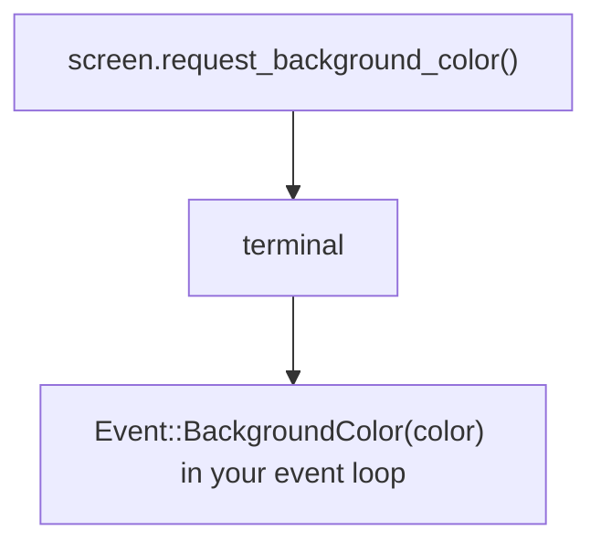

Terminals can answer questions about themselves: the background color, the pixel
size of a cell, the current cursor position, and what features they support.
uncurses models this as a request you send and a reply that comes back as an
ordinary event.

## The request and reply model

You write a request, the terminal writes an answer, and that answer arrives in
the same event stream as keystrokes. There is no separate "query" channel.




By default, `Screen::init()` sends a fixed capability probe set. Reads are pure:
`read_event`, `try_read_event`, `poll_event`, and `event_stream` do not detect
capabilities by themselves. The replies land in `capabilities()` once you pass
each event to `screen.observe_event(&ev)?`, so on a raw `Screen` that call is how
the probe results take effect. Skip it and reads still work, the replies just
never get applied. Opt out of the startup probes entirely with
`ScreenOptions { query_capabilities: false, ..Default::default() }`. The ratatui
`UncursesBackend` follows the same pure-read contract, so call `observe_event`
there too.


## Asking from a Screen

`Screen` has a `request_*` method for each common query. Each one sends the
request and flushes; the reply shows up later as an `Event` you match on in your
loop.

```rust
use uncurses::event::Event;

screen.request_background_color()?;
screen.request_cell_pixel_size()?;

// ... later, in the event loop:
let ev = screen.read_event()?;
screen.observe_event(&ev)?;

match ev {
    Event::BackgroundColor(color) => { /* use it */ }
    Event::CellPixelSize { width, height } => { /* pixels per cell */ }
    _ => {}
}
```

These cover the everyday questions: the foreground, background, cursor, and
palette colors; the cell and window pixel size; the cursor position; the color
scheme (dark or light); terminal visibility; mode state; clipboard contents; and
feature probes like kitty keyboard and modify-other-keys. For the complete set,
scan the `request_*` methods on
[`Screen`](/api/uncurses/screen/struct.Screen.html) in the API
reference; each one documents the exact `Event` variant used for its reply.
If you are using the async `event_stream()` API, use the same pattern: await an
event, call `observe_event(&ev)?`, then handle it.

## Asking without a Screen

Without `Screen`, a request is just bytes you write to the terminal, and the
reply comes back through an `EventSource`. The
[`ansi`](/api/uncurses/ansi/index.html) module has named constants for the common
requests, but any escape you write works the same way. Send the Primary Device
Attributes (DA1) request last, as a terminator: it is near-universal, and for
these probes its reply tells you the earlier replies have had their chance.
uncurses uses the same pattern for the `Screen` capability probe.

```rust
use uncurses::ansi::color::REQUEST_BACKGROUND_COLOR;
use uncurses::ansi::ctrl::REQUEST_PRIMARY_DA;
use uncurses::event::{Event, EventSource};
use uncurses::terminal::Terminal;
use std::io::Write;
use std::time::{Duration, Instant};

let mut term = Terminal::stdio();
term.make_raw()?;
let mut out = term.output();
let mut events = EventSource::new(term.input())?;

out.write_all(REQUEST_BACKGROUND_COLOR)?;
out.write_all(REQUEST_PRIMARY_DA)?; // sent last: the terminator
out.flush()?;

let deadline = Instant::now() + Duration::from_millis(300);
'wait: loop {
    let remaining = deadline.saturating_duration_since(Instant::now());
    if remaining.is_zero() || !events.poll(Some(remaining))? {
        break;
    }
    while let Some(ev) = events.try_read() {
        match ev {
            Event::BackgroundColor(c) => { /* use it */ }
            Event::PrimaryDeviceAttributes(_) => break 'wait, // done
            _ => {}
        }
    }
}

term.restore()?;
```

The deadline is the fallback for the rare terminal that ignores even DA1: if
that reply never comes, the poll times out and you move on. Most terminals
answer DA1, so the loop exits early.

See the `query` example (`cargo run --example query`) for a runnable version
that prints the background color, cursor position, and cell size.
